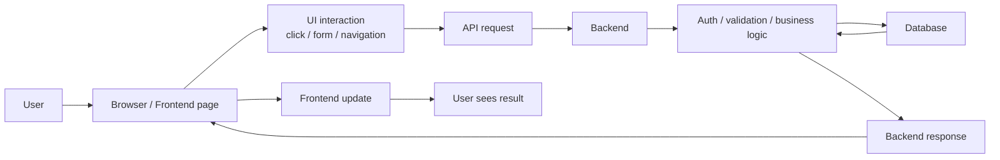

# Frontend vs Backend

You do not need to be a deep engineer to understand the difference between frontend and backend.

But if you want to build products well, choose stacks well, and work effectively with an AI coding agent, you should understand the difference at a practical level.

That is the goal of this guide.

This guide explains:

- what frontend is
- what backend is
- how they work together
- what stacks are commonly used on each side
- why the split matters
- how an AI agent can help with both

The goal is not deep theory.
The goal is a clear mental model.

## The Short Version

Frontend is the part people interact with.

Backend is the part that handles logic, data, security, and system behavior behind the scenes.

That is the simplest useful definition.

## Frontend vs Backend at a Glance

| Area | Frontend | Backend |
| --- | --- | --- |
| Main purpose | Show the app and let people interact with it | Process requests, handle logic, talk to data/services |
| Where it runs | Usually in the browser or app client | Usually on a server |
| What users directly see | Yes | No, usually indirectly |
| Main concerns | UI, UX, layout, state, interactions | APIs, auth, database access, business rules, background work |
| Typical output | Screens, buttons, forms, pages | Data, validation, decisions, persistence |
| Common failure examples | Broken layout, button does nothing, wrong page state | Login fails, data not saved, API errors, permission issues |

## What Frontend Actually Means

Frontend is the layer that the user touches.

That includes things like:

- pages
- buttons
- forms
- navigation
- dashboards
- animations
- mobile screens
- UI state

If the user can see it or click it, it is usually frontend.

Frontend answers questions like:

- what does this page look like?
- what happens when I click this button?
- how does this form behave?
- what should be shown after the data arrives?

## What Backend Actually Means

Backend is the layer that powers the app behind the scenes.

That includes things like:

- APIs
- authentication
- authorization
- database reads and writes
- business rules
- payments
- background jobs
- integrations with other services

Backend answers questions like:

- is this user allowed to do this?
- where is the data stored?
- what should happen after checkout?
- how do we validate this request?
- what should the system return to the frontend?

## A Simple Mental Model

If you imagine a restaurant:

- frontend is the dining room, menu, and waiter interaction
- backend is the kitchen, orders, inventory, and internal process

Users mostly experience the frontend.

But the backend is what makes the whole system actually work.

## How Frontend and Backend Work Together

Here is the simplest common flow:

1. User opens the app.
2. Frontend renders the page.
3. Frontend asks backend for data.
4. Backend checks logic, permissions, and data.
5. Backend returns a response.
6. Frontend updates what the user sees.

That is the basic relationship.

## Full Example: Simple Product App

Imagine a product page in an online app.

### User perspective

The user sees:

- product title
- description
- image
- price
- "Add to cart" button

That is frontend.

### Behind the scenes

When the page loads:

1. Frontend asks backend for product data.
2. Backend queries the database.
3. Backend returns the product response.
4. Frontend renders the product card.

When the user clicks "Add to cart":

1. Frontend sends a request to backend.
2. Backend validates the user/session/cart rules.
3. Backend writes the cart update.
4. Backend returns success.
5. Frontend updates the cart UI.

That is how the two sides cooperate.

## Example Flow Diagram



## Why the Split Matters

You do not need to obsess over frontend vs backend on day one.

But you should understand the split because:

- it changes how you choose a stack
- it changes where bugs live
- it changes how you debug
- it changes how you deploy
- it changes how you ask your AI agent for help

If you do not understand which side a problem belongs to, you will ask worse questions and get slower results.

## Common Frontend Stacks

These are some of the most common frontend directions people use today.

| Stack | What it is | Good for | Why people choose it |
| --- | --- | --- | --- |
| HTML / CSS / JavaScript | The basic web stack | Simple pages, very small sites, learning fundamentals | Minimal, direct, no heavy framework required |
| React + Vite | Modern client-side app stack | Dashboards, internal tools, SPAs | Fast dev workflow, strong ecosystem |
| Next.js | Full-stack React framework with strong frontend story | Marketing sites, SaaS apps, dashboards, content sites | Great default, SEO + app patterns, strong ecosystem |
| Vue / Nuxt | Another frontend ecosystem | Web apps and sites | Some teams prefer its style and structure |
| Svelte / SvelteKit | Lightweight modern frontend ecosystem | Small/medium web apps, modern UI projects | Clean developer experience, less framework noise |

### Why Next.js Is Mentioned So Often

Because it blurs the line between frontend and backend in a useful way.

With Next.js, you can often keep:

- pages
- components
- server-side logic
- API routes

inside one project.

That makes it a strong default for many builders.

## Common Backend Stacks

These are some of the most common backend directions people use today.

| Stack | Language | Good for | Why people choose it |
| --- | --- | --- | --- |
| Express | Node.js | Simple APIs, early products, straightforward backends | Easy, flexible, widely known |
| Fastify | Node.js | APIs where clean structure and speed matter | More modern structure than minimal Express |
| NestJS | Node.js / TypeScript | Larger or more structured backends | Strong architecture and organization |
| FastAPI | Python | AI-heavy backends, APIs, data services | Excellent fit for Python and AI workflows |
| Django | Python | Business apps, content systems, admin-heavy apps | Batteries-included structure |
| Django REST Framework | Python | Django projects that need APIs | Adds a strong API layer on top of Django |
| Gin / Echo / Fiber | Go | Fast APIs and backend services | Good operational simplicity and performance |
| Spring Boot | Java | Enterprise backend systems | Strong structure for large organizations |
| ASP.NET Core | C# | Enterprise and professional backend systems | Strong backend framework in the Microsoft ecosystem |
| Laravel | PHP | Practical business apps and APIs | Productive, batteries-included PHP framework |
| Ruby on Rails | Ruby | Product-heavy apps, CRUD-heavy apps | Strong conventions and productivity |

## Why Different Backend Stacks Exist

Because different products and teams optimize for different things.

Some optimize for:

- speed of shipping
- ecosystem size
- strong structure
- AI/data tooling
- deployment simplicity
- enterprise conventions

That is why there is no single backend stack for every product.

## Why Programming Language Choice Matters

At a high level, choosing a backend stack is also choosing a language ecosystem.

That matters because languages tend to be strong in different areas.

| Language | Often strong for | Why it matters |
| --- | --- | --- |
| JavaScript / TypeScript | Web products, full-stack web apps | Same language can often cover frontend and backend |
| Python | AI, data, automation, ML-related backend logic | Strong fit for RAG, embeddings, pipelines, AI services |
| Go | Services, APIs, infrastructure-style backends | Strong operational simplicity |
| Java / C# | Enterprise platforms and structured backends | Common in larger business systems |
| PHP / Ruby | Product frameworks and business apps | Productive ecosystem in the right team/context |

You do not need deep language mastery before starting.

But you should understand:

- JavaScript/TypeScript is often the strongest web default
- Python becomes very important when AI/data work becomes central
- Go is often appealing for service/backend simplicity

## Why Frontend and Backend Use Different Stacks

Because they solve different problems.

Frontend is optimized around:

- user experience
- visual rendering
- interaction
- browser behavior

Backend is optimized around:

- data
- rules
- security
- storage
- APIs
- integrations

That is why you often see combinations like:

```text
Next.js frontend
FastAPI backend
PostgreSQL database
```

or:

```text
Next.js frontend
NestJS backend
PostgreSQL database
Redis
```

or even:

```text
Next.js full-stack app
PostgreSQL
```

depending on the product.

## Do You Always Need a Separate Backend?

No.

This is very important.

Some products can start with:

- one full-stack framework
- one database
- one deployment unit

For example:

```text
Next.js + PostgreSQL
```

That can be enough for many early-stage products.

You usually split frontend and backend more aggressively when:

- the product grows
- the backend becomes more complex
- mobile and web need the same API
- AI/data services become separate
- team boundaries become clearer

## How an AI Agent Helps on Frontend

An AI agent can help with frontend work by:

- building pages
- creating components
- wiring buttons and forms
- improving layout
- explaining the current UI structure
- fixing visible bugs
- making controlled visual changes

Frontend is often one of the easiest places to feel the value of an AI coding agent quickly.

## How an AI Agent Helps on Backend

An AI agent can help with backend work by:

- explaining routes and services
- scaffolding API endpoints
- adding validation
- writing database queries
- explaining auth flow
- helping debug request/response logic
- helping compare backend frameworks

Backend is where clear prompting matters even more, because the user cannot see the result immediately in the same way as frontend.

## How to Tell Whether a Problem Is Frontend or Backend

A useful beginner question is:

**Is this a display/interaction problem, or a logic/data problem?**

Usually:

- if the UI looks wrong or a click does nothing visibly, it may be frontend
- if data is missing, not saved, rejected, or permissions fail, it may be backend
- if both seem broken, the problem may be in the connection between them

## A Good Default Mental Model for Builders

If you are building modern web products, a very useful default model is:

- frontend = Next.js or another web UI framework
- backend = API logic and system rules
- database = PostgreSQL
- optional speed layer = Redis

That is enough understanding to make a lot of good early decisions.

## Good Prompt for Frontend vs Backend Understanding

```text
Explain frontend and backend for my kind of project in simple terms.

Please:
1. explain what belongs on the frontend,
2. explain what belongs on the backend,
3. give me one practical example flow,
4. suggest a simple default stack,
5. explain how an AI agent could help on each side.
```

## Good Prompt for Choosing Frontend and Backend Stacks

```text
Help me choose a frontend and backend stack for my project.

Please:
1. ask what kind of product I am building,
2. explain the main frontend options,
3. explain the main backend options,
4. recommend the smallest practical stack,
5. explain why that choice fits,
6. explain what I probably do not need yet.
```

## Compact Summary

At a high level:

- frontend = what the user sees and interacts with
- backend = what handles logic, data, rules, and system behavior
- frontend and backend work together through APIs
- different stacks exist because they optimize for different needs
- Next.js is a strong frontend/full-stack default
- PostgreSQL is a strong database default
- backend stack choice depends a lot on product shape and complexity

You do not need deep technical mastery to understand the difference.

You need a strong practical model of what each side is for and how they cooperate.
