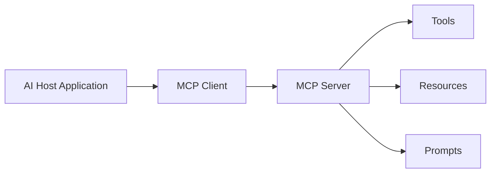
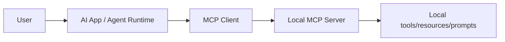
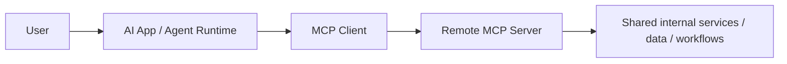
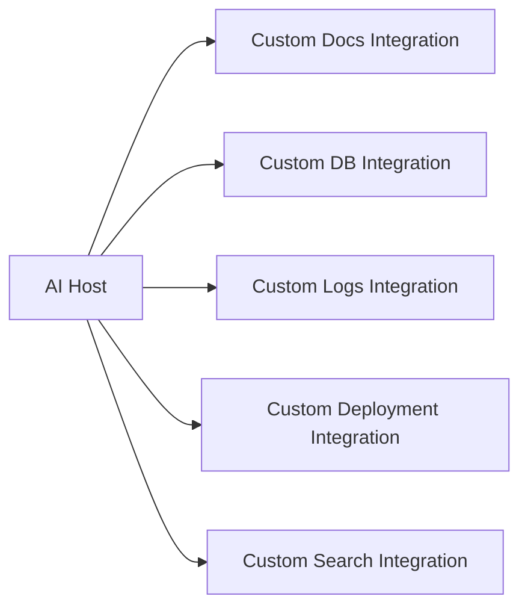
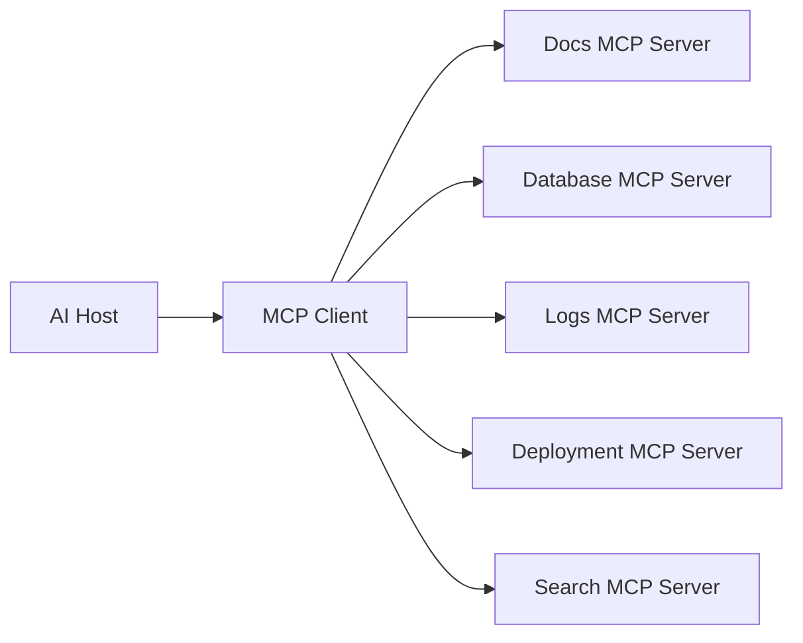
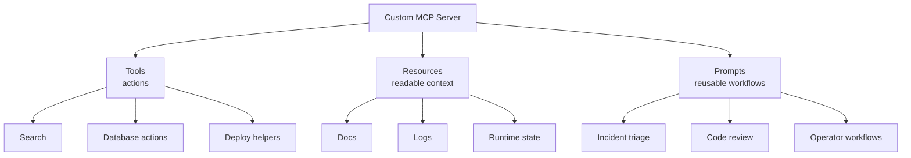
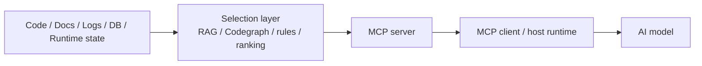
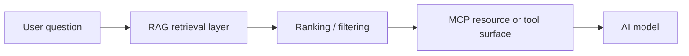
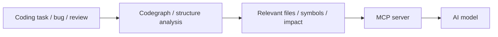
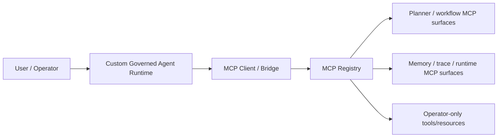

# MCP Basics

MCP means **Model Context Protocol**.

At a practical level, MCP is a standard way for AI applications and agents to connect to external capabilities.

Those capabilities can include things like:

- tools
- documentation
- databases
- logs
- search systems
- project state
- internal services
- reusable prompt templates

This guide explains MCP in plain language:

- what it is
- why it exists
- how agents use it
- how people connect it
- how to create your own MCP servers
- what to put inside them
- how to customize them
- how this can look inside a custom governed agent runtime

The goal is not protocol-level detail.
The goal is a strong mental model.

## What MCP Actually Is

The simplest way to think about MCP is:

**MCP is a standard connection layer between an AI application and external capabilities.**

Instead of hardcoding every integration in a custom way, MCP gives a more structured format for exposing useful things to an AI system.

That makes it easier for agents to work with:

- actions
- data
- context
- reusable workflows

without each integration being a one-off mess.

## Why MCP Exists

Without something like MCP, every tool integration tends to become custom glue.

That creates problems:

- each host app invents its own connection style
- each tool provider exposes different patterns
- each agent integration becomes harder to reuse
- the whole stack becomes harder to reason about

MCP is useful because it gives a shared model for:

- discovery
- invocation
- resource access
- prompt templates
- transport

That makes integrations more composable.

## The Core Mental Model

At a high level, MCP usually looks like this:



That means:

- the **host application** is the app the user interacts with
- the **MCP client** is the part that connects to MCP servers
- the **MCP server** exposes useful capabilities
- those capabilities are usually tools, resources, and prompts

## Host, Client, Server in Plain Language

| Part | What it is | What it does |
| --- | --- | --- |
| Host application | The AI app or runtime the user is actually using | Decides how MCP is used in the overall product |
| MCP client | The MCP-aware integration layer inside the host | Connects to servers, discovers capabilities, calls them |
| MCP server | The thing exposing useful functionality | Makes tools, resources, prompts, and related capabilities available |

## MCP Is Not the AI Itself

This is one of the biggest beginner confusions.

MCP is **not**:

- the model
- the agent
- the host application
- the tool itself

It is the structured connection layer that helps the AI system work with external capabilities.

A simple anti-confusion table:

| Thing | What it is |
| --- | --- |
| Model | The thing that generates and reasons over text/actions |
| Agent | The model plus workflow and decision behavior |
| Host app | The app/runtime the user is actually using |
| MCP server | The capability surface exposed to the host |
| Tool | A callable action exposed through MCP |

So the practical rule is:

**MCP is not the intelligence. MCP is part of the connection layer around the intelligence.**

## The Three Most Important MCP Primitives

The three most important MCP concepts for most people are:

- tools
- resources
- prompts

### Tools

Tools are for **doing things**.

Examples:

- query a database
- create a ticket
- start a job
- run a search
- trigger a deployment step
- calculate something

Good mental model:

**Tools are actions**

### Resources

Resources are for **reading context**.

Examples:

- docs
- config
- logs
- state snapshots
- database-backed views
- project files
- status reports

Good mental model:

**Resources are readable context**

### Prompts

Prompts are for **reusable guided interactions**.

Examples:

- code review prompt template
- incident triage template
- deployment checklist prompt
- system investigation workflow prompt

Good mental model:

**Prompts are reusable interaction templates**

## Tools vs Resources vs Prompts

| Primitive | Best mental model | Good for |
| --- | --- | --- |
| Tools | Actions | Doing something |
| Resources | Context | Reading something |
| Prompts | Reusable workflow prompts | Guiding how something should be done |

This is one of the most important ways to understand MCP well.

## When Beginners Should Care About MCP

A very simple rule:

- if you are just writing prompts in ChatGPT, you probably do not need to care about MCP yet
- if you want AI to work with files, databases, GitHub, search, deployment, logs, or internal services, MCP starts becoming important
- if you are building your own agent, runtime, or platform, MCP becomes especially important

That is the easiest way to think about it.

You do not need to start with MCP just because it exists.

But once you want AI to interact with structured external systems in a reusable way, MCP becomes much more relevant.

## How AI Agents Use MCP

At a high level, an AI agent typically uses MCP like this:

1. connect to one or more MCP servers
2. discover available capabilities
3. decide which tools/resources/prompts are relevant
4. call tools when action is needed
5. read resources when context is needed
6. use prompts when a reusable workflow should be applied

That means MCP is not just about plugging in one tool.

It is about giving the agent a structured external working surface.

## How MCP Gets Connected

There are two common mental models for how MCP gets connected:

- local process connection
- remote network connection

### Local Connection

This is often used when the MCP server is started locally by the host application.

A simple way to think about it:

- the AI app launches or attaches to the server locally
- communication happens as part of the local runtime workflow

This is often a good fit for:

- local developer tooling
- project-local context
- workstation-based agent workflows

### Remote Connection

This is often used when the MCP server runs as a separate network service.

A simple way to think about it:

- the MCP server lives elsewhere
- the client connects over HTTP-based transport
- the host can use it as a reusable shared service

This is often a good fit for:

- shared infrastructure
- team tools
- hosted internal services
- multi-user runtime environments

## MCP Transport at a High Level

For most people, the important transport distinction is:

| Transport style | Good mental model | Usually good for |
| --- | --- | --- |
| `stdio` | Local process-style connection | Local tools, process-spawned integrations, dev workflows |
| Streamable HTTP | Networked MCP service | Remote/shared MCP servers, service-style integrations |

You do not need to memorize protocol internals to use MCP well.

What matters is understanding:

- local vs remote
- bounded local tools vs shared remote service

In one sentence:

- `stdio` = local process sitting right next to the app
- remote HTTP = MCP server somewhere on the network, shared by one or more users or agents

## How People Usually Connect MCP in Practice

At a practical level, connecting MCP usually means:

1. decide what MCP server you want
2. decide whether it is local or remote
3. register it in the host/runtime config
4. provide any needed environment variables or auth
5. verify that the host can discover its capabilities

That is the practical connection model.

## Everyday Examples

Here are a few concrete examples that make MCP more tangible.

### Example 1: AI coding app + filesystem/search/deploy server

```text
AI coding app
  -> MCP client
  -> local MCP server
  -> file access / search / deploy helper tools
```

This is useful when the AI needs to do more than just answer in chat.

It can:

- inspect files
- search code
- read docs
- help with deploy steps

### Example 2: AI coding agent + docs + logs + database tools

```text
AI agent
  -> MCP client
  -> docs resource server
  -> logs resource server
  -> database tool server
```

This is useful when the AI needs to:

- read documentation
- inspect logs
- query system state
- reason about problems using structured context

### Example 3: Team runtime + shared remote MCP for infrastructure

```text
Multiple users / agents
  -> shared runtime
  -> MCP client
  -> remote MCP server
  -> shared internal infrastructure capabilities
```

This is useful when a team wants:

- shared tools
- shared runtime inspection
- common deployment helpers
- shared operational workflows

## Local MCP Example

A local MCP setup often looks like this:



This is useful when:

- the tools are developer-local
- the context is project-local
- the runtime is mostly running on one machine

## Shared Remote MCP Example

A remote/shared MCP setup often looks like this:



This is useful when:

- the same capability should serve many users or agents
- the runtime needs shared infrastructure
- the MCP server is part of a broader platform

## Why MCP Is Useful

MCP is useful because it gives AI systems a cleaner way to work with external capability surfaces.

It helps with:

- standardization
- reusability
- discoverability
- separation of concerns
- composability
- agent/tool interoperability

Instead of treating every integration as a totally custom plugin, you can think in a more uniform model.

That makes systems easier to scale and reason about.

## What MCP Solves in Plain Language

For many people, MCP feels abstract until they understand the pain it removes.

At a practical level, MCP helps solve this problem:

```text
"I have an AI system, and I want it to use many external things without turning the whole system into integration spaghetti."
```

That is the real value.

Without MCP, people often build:

- one custom integration for docs
- another custom integration for logs
- another for database actions
- another for deployment helpers
- another for internal search

Very quickly, the system becomes harder to maintain and harder for agents to reason about.

With MCP, you get a more consistent model.

## Without MCP vs With MCP

| Situation | Without MCP | With MCP |
| --- | --- | --- |
| Integration style | Every integration is different | More standardized surface |
| Discovery | The host must hardcode what exists | Capabilities can be exposed more cleanly |
| Agent understanding | Agent sees a messy collection of custom integrations | Agent sees tools/resources/prompts in a more consistent model |
| Reuse | Harder to reuse across hosts and workflows | Easier to reuse the same capability surface |
| Growth over time | More glue, more one-off code | More composable architecture |

## A Practical Before vs After Diagram

### Without MCP



### With MCP



The point is not that MCP removes all complexity.

The point is that it gives complexity a clearer shape.

## What You Can Put in Your Own MCP

This is one of the most useful questions.

You can put almost any useful agent-facing capability into an MCP server, if you structure it well.

Examples:

### Good tool candidates

- database lookup actions
- deployment helpers
- search functions
- ticketing operations
- incident actions
- file operations
- internal API wrappers
- workflow execution helpers

### Good resource candidates

- docs
- runbooks
- config snapshots
- logs
- latest system state
- inventory views
- status dashboards
- project-local reference files

### Good prompt candidates

- code review workflows
- incident triage flows
- onboarding prompts
- investigation templates
- deployment checklists
- operator workflows

The key question is:

**what does the agent need to read, do, or reuse repeatedly?**

That is usually what belongs in MCP.

## What Not to Put in MCP Carelessly

Not everything should be exposed just because it can be.

Bad ideas include:

- overly dangerous actions with no approval model
- huge unstructured surfaces the agent cannot reason about well
- unrelated capabilities mixed into one chaotic server
- vague tool names and unclear contracts
- broad internal power without trust boundaries

MCP works best when the server is:

- scoped
- intentional
- reviewable
- well named
- bounded

## How to Create Your Own MCP Server

At a high level, creating your own MCP server usually means:

1. choose a domain
2. decide what belongs as tools, resources, and prompts
3. choose how it will be connected
4. define clean contracts
5. add auth or approvals if needed
6. test discovery and usage

That is the practical design flow.

### Step 1: Choose the domain

Examples:

- project memory
- deployment control
- docs search
- workflow planning
- runtime inspection
- database tools

### Step 2: Choose the right primitives

Ask:

- is this an action? -> tool
- is this read-only context? -> resource
- is this a reusable guided interaction? -> prompt

### Step 3: Keep names and contracts clear

A good MCP server should be easy for both humans and agents to understand.

That means:

- clear names
- clear descriptions
- predictable behavior
- narrow scope where possible

### Step 4: Add boundaries

Think about:

- auth
- approval
- operator-only surfaces
- environment-specific behavior
- local-only vs shared access

### Step 5: Test it like a real surface

A good MCP server should not only exist.

It should be:

- discoverable
- understandable
- safe enough for the context
- useful in real workflows

## How You Can Customize MCP

You can customize MCP at multiple levels.

### 1. Scope customization

You can make a server:

- very small and narrow
- medium and domain-specific
- broad but carefully organized

### 2. Transport customization

You can make it:

- local
- remote
- service-like
- project-local

### 3. Capability customization

You can decide:

- which tools exist
- which resources exist
- which prompts exist
- which capabilities should stay hidden or operator-only

### 4. Trust customization

You can define:

- who can access it
- which actions need approval
- which environments allow which capabilities

### 5. Runtime customization

You can customize:

- lifecycle
- persistence
- registry behavior
- discovery behavior
- latest-state resources
- project-local aliases

This is where MCP becomes much more than a toy integration.

## What a Custom MCP Can Actually Contain

A useful way to think about your own MCP is as a carefully designed box of capabilities.



That means you are not just creating an MCP.

You are designing:

- what the agent can do
- what the agent can read
- what workflows the agent can reuse

## How AI Agents Benefit From MCP

An AI agent becomes more useful when it can work with cleanly exposed external surfaces.

MCP helps with that because it lets the agent:

- discover what exists
- use tools intentionally
- read context from resources
- reuse domain workflows via prompts
- interact with more than raw text alone

That is a big deal.

It means the agent is no longer limited to:

- only the prompt
- only the current repo
- only whatever the host app manually hardcoded in one-off ways

## MCP Can Also Be a Context Filter

This is a very important idea.

MCP is not only useful for giving an agent actions.

It can also be very useful for **filtering what context the model actually receives**.

That matters because one of the biggest practical AI problems is not only:

```text
"How do I give the model more information?"
```

It is also:

```text
"How do I avoid giving the model the wrong information, too much information, or noisy information?"
```

That is where MCP can become very powerful.

## Why Context Filtering Matters

When an AI model works on code or runtime state, raw context can easily become messy.

For example:

- too many files
- too many logs
- too much documentation
- too much irrelevant code
- too many possible search results

If you dump all of that into the model, quality often gets worse, not better.

So the real problem is often:

- what should be selected
- what should be excluded
- what should be prioritized
- what should be summarized

That is context filtering.

## Raw Context vs Filtered Context

| Approach | What happens | Typical result |
| --- | --- | --- |
| Raw context dump | Too much is sent directly to the model | More noise, weaker focus |
| Filtered context | Only the most relevant context is selected and shaped first | Cleaner reasoning, better answers |

This is one of the strongest reasons MCP can matter in serious systems.

## MCP as a Context Selection Layer

A powerful MCP server does not only expose "more stuff."

It can expose **better selected stuff**.

That means the MCP server can sit between:

- the model
- the runtime
- the knowledge sources
- the code understanding systems

and decide what should actually be surfaced.



This is a much stronger pattern than:

```text
"just give the model everything"
```

## MCP + RAG

RAG is useful because it helps retrieve the most relevant knowledge before the model answers.

When MCP is placed in front of a RAG system, MCP can expose:

- retrieval tools
- ranked search results
- filtered document resources
- operator-reviewed knowledge surfaces

That means MCP is not only a transport layer.

It can become the layer that says:

- which retrieval path to use
- which result set to expose
- which result format the model should see
- what should stay out

### MCP + RAG mental model



## MCP + Codegraph

Codegraph-style systems are useful because they help the agent understand code structure more intelligently than raw file dumping.

A codegraph can help answer questions like:

- which files matter most
- which symbols are related
- what changed
- where call paths go
- what code is high impact

If MCP sits in front of codegraph-style capability, then MCP can expose:

- codegraph query tools
- related-file resources
- impact-analysis resources
- narrowed code context instead of whole-repo noise

That means the model gets:

- more relevant code
- less irrelevant code
- better structured context

### MCP + Codegraph mental model



## RAG vs Codegraph vs Combined

| Layer | Best for | What it filters |
| --- | --- | --- |
| RAG | Knowledge/document retrieval | Which docs, notes, or knowledge chunks matter |
| Codegraph | Code structure understanding | Which files, symbols, and relationships matter |
| MCP | Exposure and delivery layer | What the agent/model can actually see and use |

This is why a stronger runtime can combine them.

RAG helps with knowledge.
Codegraph helps with code structure.
MCP helps expose the right filtered surfaces to the agent.

## What This Means in a Custom Governed Runtime

In a more serious custom runtime, MCP can sit on top of:

- retrieval systems
- codegraph systems
- planner systems
- runtime-inspection systems
- memory systems

and decide what becomes available as:

- tools
- resources
- prompts

That means MCP can become a practical context-control layer, not only a tool registry.

## Why This Is Powerful

Because better AI behavior often depends less on "more total context" and more on:

- better selected context
- better ordered context
- safer context
- more relevant context

That is exactly the kind of thing a custom MCP layer can help enforce.

## A Simple Before vs After for Code Work

| Mode | What the model sees |
| --- | --- |
| No filtering | Large raw file dump, logs, docs, mixed noise |
| MCP + filtering | Ranked docs, relevant files, impact paths, filtered runtime context |

That difference can be huge for:

- code review
- debugging
- deployment investigation
- multi-file refactors
- agent planning

## What MCP Can Look Like in a Custom Governed Runtime

A useful way to understand MCP is to imagine it inside a custom governed agent runtime.

In that kind of system, MCP is not just a side plugin.

It can become a serious runtime surface.

At a high level, a custom governed runtime might expose things like:

- an MCP bridge surface
- local-only or loopback-only MCP access
- a registry of MCP servers or instances
- lifecycle and persistence rules for those MCP instances
- MCP-backed planner, memory, trace, or runtime-inspection surfaces
- operator-only resources and actions

That can look something like this:



That is useful because it shows a more advanced truth:

**MCP is not only for exposing one random external tool.**

It can become part of the runtime architecture of an agentic system.

## What This Kind of Example Teaches

Using a custom governed runtime as the example shows a few important ideas:

### MCP can be governed

It does not have to be a loose pile of tool definitions.

It can have:

- lifecycle
- persistence
- recovery
- scoped exposure
- operator boundaries

### MCP can expose both action and inspection surfaces

It can expose:

- tools for doing things
- resources for reading current system state
- prompts for reusable workflows

### MCP can be part of system architecture

It can sit inside a broader runtime, not only at the edge.

That makes it useful for:

- internal runtime tooling
- agent operations
- workflow systems
- governed execution

## What This Gives You in Practice

If you build MCP into a more serious custom runtime, it can give you things like:

- cleaner tool discovery
- reusable context surfaces
- operator-friendly inspection
- safer boundaries between read-only and action surfaces
- clearer separation between local-only and shared capabilities
- a more modular way to grow your agent system over time

In other words:

it helps turn "a bunch of random integrations" into "a more structured agent platform."

## What You Mean by a Custom MCP-Based Runtime

If you are explaining your own kind of solution to people, the practical meaning is usually this:

- the AI system is not just one model with one prompt
- it has structured surfaces for action, context, and reusable workflows
- those surfaces are exposed in a way the agent can discover and use consistently
- the runtime can decide what is local, what is remote, what is safe, and what is operator-only

That is a much stronger model than:

- one giant prompt
- one pile of one-off tools
- one hardcoded integration for each thing

It gives you a more governable system.

## A Good Default Mental Model

If you want the simplest useful mental model, use this:

```text
MCP is how an AI system can connect to structured external capabilities in a standard way.
```

And then:

- tools = actions
- resources = context
- prompts = reusable workflows

That one model gets you surprisingly far.

## Good Prompt for Understanding MCP

```text
Explain MCP to me in simple terms.

Please:
1. explain what MCP is,
2. explain the difference between tools, resources, and prompts,
3. explain how an AI agent uses them,
4. explain when MCP is useful,
5. give one practical example.
```

## Good Prompt for Designing Your Own MCP

```text
Help me design an MCP server for my project.

Please:
1. ask what domain or workflow I want to expose,
2. identify what should be a tool,
3. identify what should be a resource,
4. identify what should be a prompt,
5. suggest the smallest useful first version,
6. explain what should stay out of scope for now.
```

## Good Prompt for Reviewing an Existing MCP Design

```text
Inspect this MCP design first.

Please:
1. explain what capabilities it exposes,
2. explain whether the tool/resource/prompt split makes sense,
3. identify anything too broad or risky,
4. suggest how to make it cleaner and more bounded,
5. explain the advice in plain language.
```

## Compact Summary

At a high level:

- MCP = a standard way for AI systems to connect to external capabilities
- host app + client + server is the core shape
- tools = actions
- resources = readable context
- prompts = reusable workflows
- local vs remote transport matters
- good MCP design is scoped, intentional, and bounded
- MCP can become part of a serious runtime architecture, not just a toy plugin surface

You do not need deep protocol knowledge to understand why MCP matters.

You need a good abstract model of how it helps agents work with real systems.
